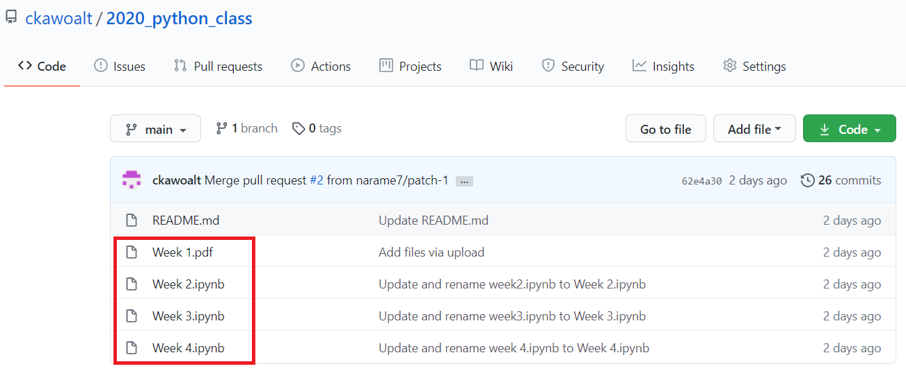
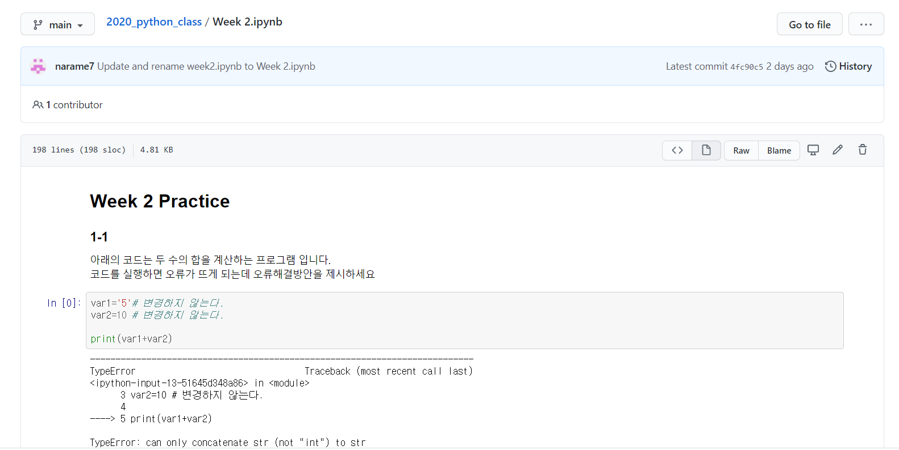
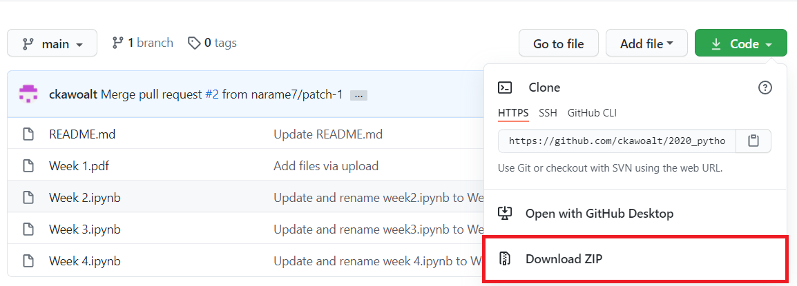
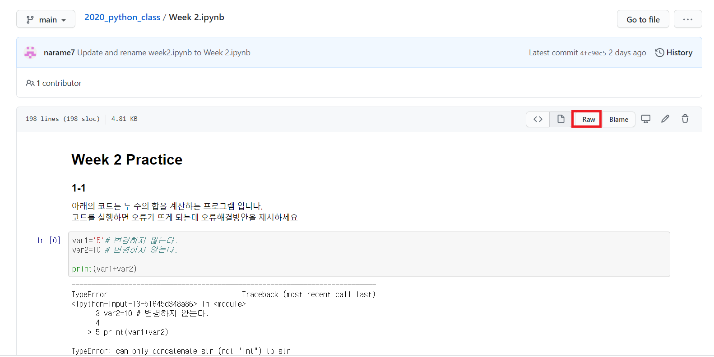
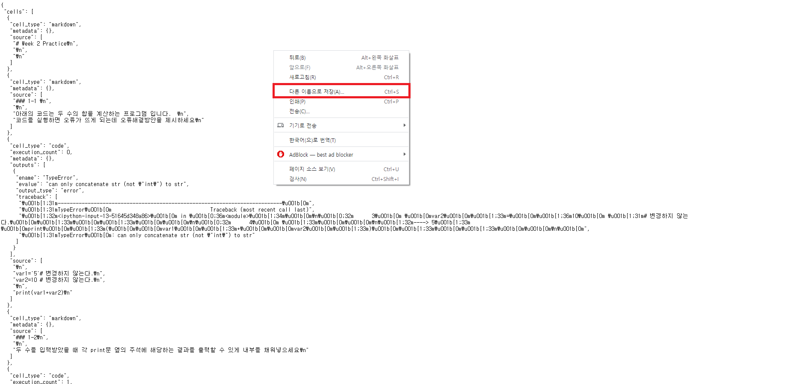
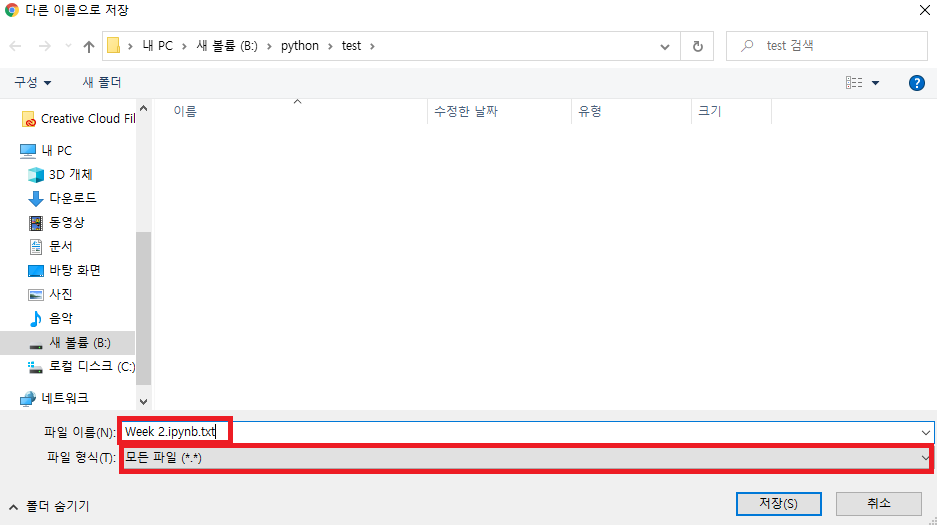
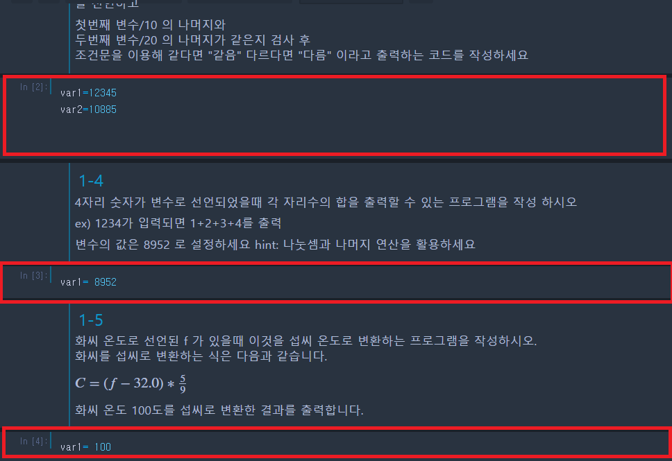

# 2020 KNU 바이오데이터 엔지니어 양성사업

## 초급 과정 '파이썬 프로그래밍'

# github 사용법 

처음 접속한 페이지에서 목록들을 보면(만약 목록이 보이지 않다면 해당 위치에 있는 view code를 눌러 주세요)

매 주차별 과제 목록을 볼 수 있습니다.

주차에 해당하는 과제 파일을 클릭하시면 파일의 내용을 확인 할 수 있습니다.(파일 옆의 메세지를 클릭하는게 아닌 파일 이름 자체를 클릭하시면 됩니다.)

## 다운로드 방법

### 1. 전체 다운로드

 

맨 처음의 페이지에서 code 라고 쓰여진 초록색 버튼을 클릭하게 되면 zip형태로 모든 파일을 다운로드 할 수 있습니다.

### 2.원하는 파일만 다운로드

원하는 파일을 다운로드 하기 위해서는 파일을 클릭하여 파일 내용 부분에서 빨간색 네모 쳐진 부분

Raw라고 씌여진 부분을 클릭합니다.

그렇게 하게되면 해당 화면이 띄워지게 되는데 이 화면에서 마우스 우클릭-> 다른이름으로 저장 버튼을 클릭해 파일을 저장하시면 됩니다.

파일 저장시 주의 하셔야 할 점은 파일 형식은 **모든 파일 형식**으로 저장하시고 

파일 이름에 .txt가 붙었다면 뒤의 부분을 제외하고 .ipynb 형식으로 끝나도록 저장 하셔야 합니다.

파일 저장 위치는 맨처음 파이썬 설치 튜토리얼에서 

기본 위치(c:/user/"사용자이름"  또는 c:/사용자/"사용자 이름")

위치에 튜토리얼에 따라 생성하신 파일 위치에 다운로드를 받으시고 주피터 노트북 프로그램 열어 다운받은 프로그램을 열람 할 수 있습니다.

# 제출 양식

다운받으신 파일을 열게 되면 다음과 같이 문제 설명과 코딩을 할 수 있는 블럭(빨간 박스)가 있는데

문제 설명을 읽으시고 빨간박스에 문제에 맞는 코드를 채워 넣고 저장하시면 됩니다.

과제 제출은 이루리 페이지를 통해 하시면 되는데

주피터 노트북 저장 위치로 이동해 원본 파일을 zip 형식으로 묶어서 제출하시면 됩니다.

 ex) Lecture 3.ipynb,Lecture 4.ipynb,Lecture 5.ipynb 파일을 모아서 week 2_사번\_이름.zip 의 형태로 제출해 주시면 됩니다.

